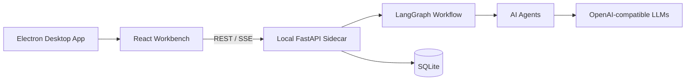

<div align="center">

# Novelos

**A local-first AI workbench for long-form fiction**

English | [中文](README.zh-CN.md)

[](https://www.python.org/)
[](https://fastapi.tiangolo.com/)
[](https://react.dev/)
[](https://www.electronjs.org/)
[](https://langchain-ai.github.io/langgraph/)
[](https://www.sqlite.org/)
[](LICENSE)

</div>

Novelos helps writers build long-form fiction projects with a local desktop app, AI agents, structured project memory, and an auditable chapter production workflow.

It ships as an Electron desktop client with an embedded React workbench and a local FastAPI sidecar. Your project data lives locally in SQLite.

## Highlights

- **Desktop-first writing workbench** for planning, drafting, revising, reviewing, and publishing chapters.
- **Agent chapter workflow** powered by LangGraph: planner, screenwriter, author, polisher, editor, memory curator, and publisher.
- **Project memory system** for characters, world settings, factions, outlines, plot holes, instructions, and story facts.
- **Genesis quality gate** with depth checks for character motivations, faction actions, plot hole design, and outline specificity to prevent shallow project initialization.
- **Runtime hygiene and observability** with unified version source, sensitive information redaction in errors and logs, and structured health diagnostics.
- **Project-level style management (v6.10.4)** with canonical Style Bible initialization, structured editing, genre-aware templates, and Style Gate configuration. Style rules are injected into all real-mode generation paths (planner, screenwriter, author, polisher, editor).
- **Story Contract Governance (v6.10.5)** with project-level core-loop contracts, supporting-mechanism drift checks, ChapterBrief payoff targets, core-loop quality gate diagnostics, and editable Story Contract controls in the project workspace.
- **Quality diagnosis and revision support** for AI trace, pacing, dialogue, scene texture, info dumps, show-don't-tell, and editor gates.
- **Run observability and diagnosis** with node events, artifacts, LLM latency/tokens, Run Doctor attribution, retry actions, recovery tools, and memory backfill.
- **Publish safety guards** for continuity, memory readiness, and malformed or truncated chapter titles.
- **Agent-level LLM routing** so different agents can use different model profiles.
- **Local-first runtime** with SQLite, desktop logs, local config, and Electron `safeStorage` for API keys.

## Workspace Areas

The desktop client includes:

- project onboarding and context setup
- chapter writing surface
- workflow timeline and run details
- memory inbox
- quality diagnosis panel
- LLM and local service settings
- light and dark themes

## How It Works



The desktop app starts a local sidecar on `127.0.0.1` with a random port. The sidecar serves the API, runs the chapter workflow, stores project data in SQLite, and calls configured LLM providers when running in real mode.

## Quick Start

### Requirements

- macOS for the current packaged desktop build
- Python 3.9+
- Node.js 18+
- npm

### Install

```bash
python3 -m pip install -e .

cd frontend
npm install
cd ..

cd desktop
npm install
cd ..
```

### Run the Desktop App in Development

```bash
cd desktop
npm run dev
```

For frontend hot reload, start Vite in another terminal:

```bash
cd frontend
npm run dev
```

Then run the desktop app again:

```bash
cd desktop
npm run dev
```

### Build the macOS App

```bash
bash packaging/scripts/build-desktop-mac.sh --dir
```

Output:

```text
desktop/release/mac-arm64/Novelos.app
```

Build a DMG:

```bash
bash packaging/scripts/build-desktop-mac.sh --dmg
```

## Browser Development Mode

The browser mode is useful for frontend/backend debugging, but it is not the primary user runtime.

Start the API:

```bash
novelos api \
  --host 127.0.0.1 \
  --port 8765 \
  --db-path acceptance_novel_factory.db \
  --config config/local.yaml \
  --llm-mode stub
```

Start the frontend:

```bash
cd frontend
npm run dev
```

Open `http://127.0.0.1:5173`.

## LLM Configuration

Novelos supports two modes:

| Mode | Purpose |
| --- | --- |
| `stub` | Local demo and deterministic tests. No external API calls. |
| `real` | Real LLM generation and review. Requires provider credentials. |

The desktop settings UI supports reusable LLM profiles and agent routing. For example:

- `default` for general agents
- `author` for long-form drafting
- `editor` for review
- `memory_curator` for memory extraction

Agents without an explicit route fall back to `default`.

YAML configuration is also supported:

```yaml
default_llm: default

llm_profiles:
  default:
    provider: openai_compatible
    base_url_env: OPENAI_BASE_URL
    api_key_env: OPENAI_API_KEY
    model: gpt-4o-mini
  author:
    provider: openai_compatible
    base_url_env: OPENAI_BASE_URL
    api_key_env: OPENAI_API_KEY
    model: gpt-4o-mini

agent_llm:
  planner: default
  screenwriter: default
  author: author
  polisher: default
  editor: default
  memory_curator: default
```

Validate configuration:

```bash
novelos --config config/local.yaml --llm-mode real llm validate --json
```

Inspect an agent route:

```bash
novelos --config config/local.yaml llm route --agent author --json
```

## Useful Commands

```bash
# Seed demo data
novelos --db-path acceptance_novel_factory.db seed-demo --project-id demo

# Generate a chapter in stub mode
novelos --db-path acceptance_novel_factory.db run-chapter \
  --project-id demo \
  --chapter 1 \
  --llm-mode stub \
  --json

# Check chapter status
novelos --db-path acceptance_novel_factory.db status \
  --project-id demo \
  --chapter 1 \
  --json

# List workflow runs
novelos --db-path acceptance_novel_factory.db runs \
  --project-id demo \
  --json
```

Backfill memory extraction for a completed chapter:

```bash
python3 scripts/backfill_chapter_memory.py \
  --db-path acceptance_novel_factory.db \
  --project-id demo \
  --chapter 3 \
  --llm-mode real \
  --config config/local.yaml \
  --json
```

## Project Structure

```text
desktop/              Electron desktop shell and packaging
frontend/             React + Vite author workbench
novel_factory/api/    FastAPI routes
novel_factory/agents/ AI agent implementations
novel_factory/workflow/ LangGraph workflow and recovery logic
novel_factory/llm/    LLM providers and profile routing
novel_factory/db/     SQLite repositories and migrations
scripts/              Local operations and diagnostics
packaging/            Sidecar and desktop build scripts
tests/                Backend regression tests
docs/codex/           Planning, reports, and reviews
```

## Testing

Backend:

```bash
python3 -m pytest -q
python3 scripts/verify.py smoke
```

Frontend:

```bash
cd frontend
npm run typecheck
npm run lint
npm run build
npm run test -- --run
```

Desktop:

```bash
cd desktop
npm run typecheck
npm run build
```

Packaged app checks:

```bash
bash packaging/scripts/smoke-sidecar.sh
bash packaging/scripts/verify-desktop-mac.sh
```

## Documentation

- [Documentation index](docs/codex/README.md)
- [Desktop client plan](docs/codex/planning/novel-factory-cross-platform-desktop-client-plan.md)
- [Interaction excellence spec](docs/codex/planning/novel-factory-v6.5-interaction-excellence-spec.md)
- [Chapter quality closure spec](docs/codex/planning/novel-factory-v6.4-chapter-quality-closure-spec.md)

## Notes

- The current UI is the React workbench under `frontend/`, embedded in Electron for the desktop product.
- Historical Jinja/static WebUI paths are retired.
- Desktop runtime data is stored under the OS app data directory, for example `~/Library/Application Support/novelos-desktop/` on macOS.
- SQLite databases, WAL files, desktop release output, build output, Python caches, and `node_modules` are gitignored.

## License

Novelos is licensed under the [MIT License](LICENSE).
