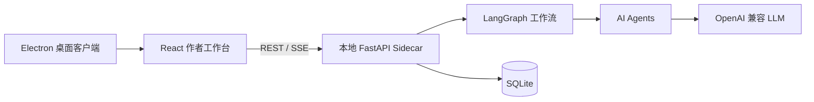

<div align="center">

# Novelos

**本地优先的 AI 长篇小说创作工作台**

[English](README.md) | 中文

[](https://www.python.org/)
[](https://fastapi.tiangolo.com/)
[](https://react.dev/)
[](https://www.electronjs.org/)
[](https://langchain-ai.github.io/langgraph/)
[](https://www.sqlite.org/)
[](LICENSE)

</div>

Novelos 是一个面向长篇小说创作的本地桌面工作台，结合 AI Agent、结构化项目记忆和可审计的章节生产工作流，帮助作者完成规划、起草、返修、审校和发布。

它以 Electron 桌面客户端交付，内嵌 React 作者工作台，并在本机启动 FastAPI sidecar。项目数据默认保存在本地 SQLite 中。

## 亮点

- **桌面优先的创作工作台**：用于章节规划、起草、返修、审校和发布。
- **Agent 章节流水线**：基于 LangGraph，包含 planner、screenwriter、author、polisher、editor、memory curator、publisher。
- **项目记忆系统**：管理角色、世界观、势力、大纲、伏笔、章节指令和事实账本。
- **核心循环证据治理（v6.10.7）**：针对奖励获得、奖励使用、敌方反噬、必需卖点兑现和数值状态继承做正文证据校验。
- **创世稳定性强化（v6.10.6）**：结构化章节指令契约、章节指令定向返修，以及与分段 real-mode 生成对齐的深度质量门，防止空泛创世资料进入生产。
- **运行时卫生与可观测性**：统一版本来源、错误信息脱敏、关键路径异常可观测、结构化 health 诊断。
- **项目级风格管理（v6.10.4）**：支持 canonical Style Bible 初始化、结构化编辑、按题材选择模板和风格门禁配置。风格规则会注入 planner、screenwriter、author、polisher、editor 等真实生成链路。
- **故事合同治理（v6.10.5+）**：支持项目级核心循环合同、辅助机制漂移检查、章节 Brief 核心兑现目标、证据化核心循环质检诊断，以及项目工作台中的 Story Contract 编辑入口。
- **质量诊断与返修支持**：检测 AI 痕迹、节奏、对白、场景质感、信息倾倒、Show Don't Tell，并辅助 Editor 质量门。
- **运行可观测性与诊断**：节点事件、产物、LLM 耗时/token、Run Doctor 故障归因、重试动作、恢复工具和记忆补跑。
- **发布安全门禁**：发布前检查连续性、记忆可信度，以及缺失、截断或与正文脱节的章节标题。
- **Agent 级 LLM 路由**：不同 Agent 可以使用不同模型档案。
- **本地优先运行时**：SQLite、本地日志、本地配置，以及 Electron `safeStorage` 管理 API Key。

## 工作台模块

桌面客户端包含：

- 项目初始化和上下文设置
- 章节写作工作台
- 工作流时间线和运行详情
- 记忆收件箱
- 质量诊断面板
- LLM 与本地服务配置
- 日间/夜间主题

## 工作方式



桌面客户端会在 `127.0.0.1` 随机端口启动本地 sidecar。sidecar 提供 API、运行章节工作流、把项目数据写入 SQLite，并在 real 模式下调用已配置的 LLM Provider。

## 快速开始

### 环境要求

- 当前桌面打包路径主要面向 macOS
- Python 3.9+
- Node.js 18+
- npm

### 安装

```bash
python3 -m pip install -e .

cd frontend
npm install
cd ..

cd desktop
npm install
cd ..
```

### 开发模式启动桌面客户端

```bash
cd desktop
npm run dev
```

如果需要前端热更新，另开一个终端启动 Vite：

```bash
cd frontend
npm run dev
```

然后再启动桌面客户端：

```bash
cd desktop
npm run dev
```

### 构建 macOS App

```bash
bash packaging/scripts/build-desktop-mac.sh --dir
```

输出位置：

```text
desktop/release/mac-arm64/Novelos.app
```

构建 DMG：

```bash
bash packaging/scripts/build-desktop-mac.sh --dmg
```

## 浏览器开发模式

浏览器模式适合调试前后端，但不是主要用户运行方式。

启动 API：

```bash
novelos api \
  --host 127.0.0.1 \
  --port 8765 \
  --db-path acceptance_novel_factory.db \
  --config config/local.yaml \
  --llm-mode stub
```

启动前端：

```bash
cd frontend
npm run dev
```

访问 `http://127.0.0.1:5173`。

## LLM 配置

Novelos 支持两种模式：

| 模式 | 用途 |
| --- | --- |
| `stub` | 本地演示和确定性测试，不调用外部 API |
| `real` | 真实 LLM 生成和审校，需要 Provider 凭据 |

桌面配置页支持可复用 LLM 档案和 Agent 路由。例如：

- `default` 用于通用 Agent
- `author` 用于长文本执笔
- `editor` 用于审校
- `memory_curator` 用于记忆提取

未显式配置路由的 Agent 会回退到 `default`。

也可以使用 YAML 配置：

```yaml
default_llm: default

llm_profiles:
  default:
    provider: openai_compatible
    base_url_env: OPENAI_BASE_URL
    api_key_env: OPENAI_API_KEY
    model: gpt-4o-mini
  author:
    provider: openai_compatible
    base_url_env: OPENAI_BASE_URL
    api_key_env: OPENAI_API_KEY
    model: gpt-4o-mini

agent_llm:
  planner: default
  screenwriter: default
  author: author
  polisher: default
  editor: default
  memory_curator: default
```

验证配置：

```bash
novelos --config config/local.yaml --llm-mode real llm validate --json
```

查看某个 Agent 的路由：

```bash
novelos --config config/local.yaml llm route --agent author --json
```

## 常用命令

```bash
# 创建演示数据
novelos --db-path acceptance_novel_factory.db seed-demo --project-id demo

# Stub 模式生成章节
novelos --db-path acceptance_novel_factory.db run-chapter \
  --project-id demo \
  --chapter 1 \
  --llm-mode stub \
  --json

# 查看章节状态
novelos --db-path acceptance_novel_factory.db status \
  --project-id demo \
  --chapter 1 \
  --json

# 查看工作流运行记录
novelos --db-path acceptance_novel_factory.db runs \
  --project-id demo \
  --json
```

为已完成章节补跑记忆提取：

```bash
python3 scripts/backfill_chapter_memory.py \
  --db-path acceptance_novel_factory.db \
  --project-id demo \
  --chapter 3 \
  --llm-mode real \
  --config config/local.yaml \
  --json
```

## 项目结构

```text
desktop/              Electron 桌面壳和打包配置
frontend/             React + Vite 作者工作台
novel_factory/api/    FastAPI 路由
novel_factory/agents/ AI Agent 实现
novel_factory/workflow/ LangGraph 工作流和恢复逻辑
novel_factory/llm/    LLM Provider 与档案路由
novel_factory/db/     SQLite repository 和 migration
scripts/              本地运维和诊断脚本
packaging/            Sidecar 与桌面端构建脚本
tests/                后端回归测试
docs/codex/           规划、报告和审查文档
```

## 测试

后端：

```bash
python3 -m pytest -q
python3 scripts/verify.py smoke
```

前端：

```bash
cd frontend
npm run typecheck
npm run lint
npm run build
npm run test -- --run
```

桌面端：

```bash
cd desktop
npm run typecheck
npm run build
```

打包检查：

```bash
bash packaging/scripts/smoke-sidecar.sh
bash packaging/scripts/verify-desktop-mac.sh
```

## 文档

- [文档索引](docs/codex/README.md)
- [桌面客户端规划](docs/codex/planning/novel-factory-cross-platform-desktop-client-plan.md)
- [交互体验规格](docs/codex/planning/novel-factory-v6.5-interaction-excellence-spec.md)
- [章节质量闭环规格](docs/codex/planning/novel-factory-v6.4-chapter-quality-closure-spec.md)

## 说明

- 当前 UI 是 `frontend/` 下的 React 工作台，并嵌入 Electron 作为桌面产品。
- 历史 Jinja/static WebUI 路线已退役。
- 桌面运行数据位于系统应用数据目录，例如 macOS 的 `~/Library/Application Support/novelos-desktop/`。
- SQLite 数据库、WAL 文件、桌面 release 输出、构建产物、Python 缓存和 `node_modules` 均已忽略。

## 许可证

Novelos 使用 [MIT License](LICENSE) 开源。
